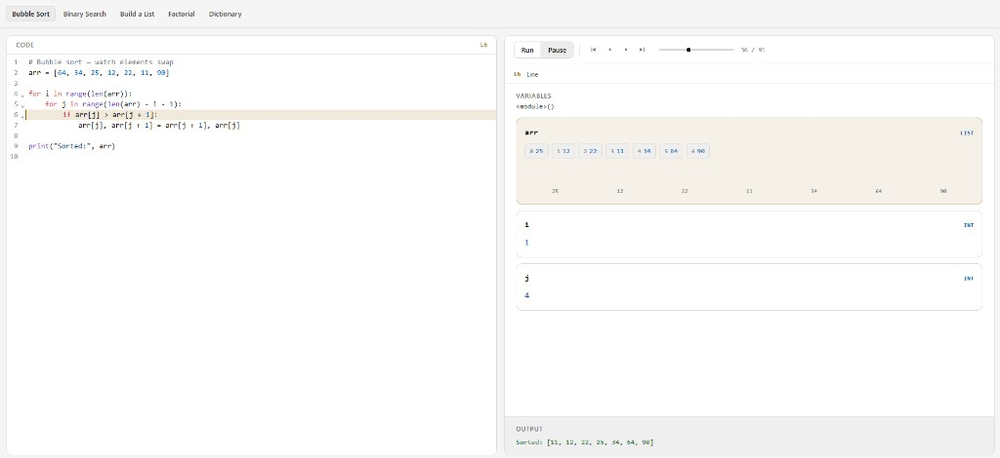

# Glass

Step through Python code and watch variables change — entirely in your browser.



## Quick start

```bash
npm install
npm run dev
```

Open http://localhost:5173

## Features

- Paste or edit Python code with syntax highlighting
- Step-by-step execution with Play / scrub controls
- Visual variable panels — lists, bar charts, dicts
- Built-in examples: bubble sort, binary search, recursion, and more
- Dark / light mode

## Stack

React · TypeScript · Vite · Pyodide · CodeMirror · Tailwind CSS
